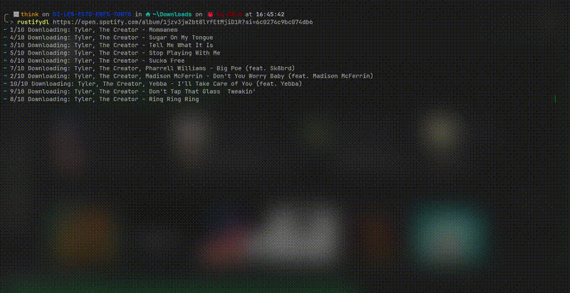

# RustifyDL

<div align="center">

[](https://crates.io/crates/rustifydl)
[](https://docs.rs/rustifydl)
[](https://www.gnu.org/licenses/gpl-3.0)


A Spotify downloader written in Rust.

</div>

---

Turn any Spotify track/album/playlist URL into properly tagged audio files. RustifyDL pairs Spotify metadata with audio from YouTube, then writes tidy tags and artwork so your library looks right everywhere.

## Features
- Downloads tracks in parallel
- Writes clean metadata (artist, album, track numbers, cover art)
- Uses FFmpeg for conversion and bitrate control
- Quiet by default, more logs if you want them
- Works as both a CLI tool and a Rust library

## Demo



## Installation

### From crates.io
```bash
cargo install rustifydl
```
### From source
Prerequisites:
- FFmpeg on PATH

```bash
git clone https://github.com/ThePangel/RustifyDL.git
cd RustifyDL
cargo install --path . --force
```

## Usage

### Command Line Interface
```bash
rustifydl "https://open.spotify.com/album/..."
```

**Common options** (see `rustifydl --help` for full list):
- `-o, --output-dir <PATH>`  Output folder (default: `./output`)
- `--concurrent-downloads <N>`  Parallel downloads (e.g., 6 or 10)
- `--bitrate <RATE>`  FFmpeg bitrate, e.g., `192k`, `256k`, `320k`
- `--format <EXT>`  Output format, e.g., `mp3`, `m4a`, `opus`, `flac`
- `-v, --verbosity <LEVEL>`  `none`, `info`, `debug`, `full`
- `--no-dupes`  Skip duplicate track names when collecting

### Library Usage
Add to project:
```bash
cargo add rustifydl
```

Example usage:
```rust
use rustifydl::{download_spotify, DownloadOptions};

#[tokio::main]
async fn main() -> Result<(), Box<dyn std::error::Error + Send + Sync>> {
    let opts = DownloadOptions {
        url: "https://open.spotify.com/album/xxxxxxxx".into(),
        client_id: "<your_spotify_client_id>".into(),
        client_secret: "<your_spotify_client_secret>".into(),
        output_dir: "./downloads".into(),
        concurrent_downloads: 6,
        no_dupes: true,
        bitrate: "192k".into(),
        format: "mp3".into(),
        verbosity: "info".into(),
        no_tag: false,
    };
    
    download_spotify(opts).await?;
    Ok(())
}
```

## Configuration (Automatic)
RustifyDL manages Spotify API credentials automatically. On first use it creates a config file and reuses it next time—no need to pass credentials on the command line.

Config location examples:
- Windows: `%APPDATA%/RustifyDL/config.toml`
- Linux:   `~/.config/RustifyDL/config.toml`
- macOS:   `~/Library/Application Support/RustifyDL/config.toml`

To reset, delete the file and run again.


## Project Structure
```
src/
├── lib.rs         # Library API & orchestration
├── metadata.rs    # Tag writing (lofty)
├── spotify.rs     # Spotify fetch (spotify-rs)
└── youtube.rs     # YouTube download (rustypipe + yt_dlp + ffmpeg)
```

## Contributing
Contributions are welcome! Please feel free to submit a Pull Request.

## Status
Active development (When and if I feel like it, works for now)

## License
This project is licensed under the GNU General Public License v3.0 - see the [LICENSE](LICENSE) file for details.

## Support
If you encounter issues or have questions, please [open an issue](https://github.com/ThePangel/RustifyDL/issues).

---
Built with Rust 🦀 and 💖 by thepangel ^_____^